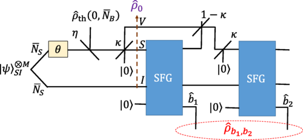

# Gaussian States Toolkit — Demonstrations

Example applications of the Gaussian state manipulation tools from the parent directory. Each notebook demonstrates a complete research workflow: state preparation, evolution through optical circuits, and information-theoretic analysis.

---

## Contents

| Notebook | Application Domain | Key Result |
|----------|-------------------|------------|
| `BeamDisplacement_Debug.nb` | Quantum target detection | Optimizes spatial mode for quantum-enhanced sensing |
| `chernoff-exponent.nb` | Quantum hypothesis testing | Computes QCE for multimode Gaussian state discrimination |
| `SFG_evolution_organized.nb` | Nonlinear quantum optics | Three-wave mixing in χ⁽²⁾ media (SFG gate simulation) |

---

## BeamDisplacement_Debug.nb

### Problem Statement

**Quantum target detection** in a stand-off sensing scenario:
- **Transmitter:** Prepares a signal beam in a displaced squeezed Gaussian state with optimized spatial mode  
- **Channel:** Free-space propagation with Fresnel diffraction, optional target reflection  
- **Receiver:** Joint quantum measurement on signal + idler (mode-matched homodyne or photon counting)

**Goal:** Maximize the **Quantum Chernoff Exponent (QCE)** for discriminating H₀ (no target) vs. H₁ (target present), subject to constraints on mean photon number and beam geometry.

**Classical benchmark:** Fisher information bound from intensity measurements  
**Quantum advantage:** Entanglement-assisted detection via squeezed vacuum idler mode

---

### Key Parameters

- **Fresnel number product:** Df = D_transmit · D_receive / (λL)  
  - Controls diffraction spreading over propagation distance L  
  - Example: Df = 45 → moderate diffraction (signal spreads by ~factor of 2 at receiver)

- **Total mean photon number:** N_tot = N_signal + N_idler  
  - Constrained by transmitter power budget  
  - Example: N_tot = 16 → ~10^(-18) W optical power for λ = 1.55 μm

- **Spatial mode shape:** Parameterized as Laguerre-Gaussian or Hermite-Gaussian basis  
  - Optimized to maximize overlap with receiver aperture after diffraction

---

### Methodology

1. **Decompose spatial mode** into Hermite-Gaussian basis via Gram-Schmidt (functions from `GaussianStates_clean.nb`)
2. **Evolve covariance matrix** under free-space propagation (paraxial ABCD matrix)
3. **Apply displacement** corresponding to target reflection (small displacement limit: ε ≪ 1)
4. **Compute QCE** using Pirandola et al.'s formula (from `chernoff-exponent.nb`)
5. **Optimize** squeezing parameter r and mode coefficients via `NMaximize`

---

### Example Result


**Top row:** Magnitude |Ψ_Q|², real part Re(Ψ_Q), imaginary part Im(Ψ_Q) of the optimal quantum probe mode in position space  
**Bottom plot:** Fock expansion coefficients c_k showing the mode is predominantly Gaussian (exponential decay)

**Parameters:**
- **Displacement mean-photon allocation:** N₁ = 1.77×10⁻¹⁵ (essentially zero displacement)  
- **Squeezing mean-photon allocation:** N₂ = 16 (all power in squeezed vacuum idler)  
- **Quantum Probe Chernoff Exponent:** 3327.14 d² (where d is normalized displacement)  

**Interpretation:**  
At Df = 45 and N_tot = 16, the optimal strategy is to use *pure squeezing* with no signal displacement. The quantum advantage comes entirely from quantum correlations between signal and idler, not from classical signal power. This regime demonstrates **quantum illumination** — entanglement-enhanced target detection superior to classical coherent-state radar.

**Dotted circle in Wigner plots:** Classical uncertainty limit (ℏ/2 variance). The squeezed mode compresses noise below this limit in one quadrature (enabling sub-shot-noise detection), at the cost of increased noise in the conjugate quadrature.

---

### Dependencies

**From parent directory:**
- `GaussianStates_clean.nb` — spatial mode decomposition (`SMSgen`, `DisplacementOp`)  
- `chernoff-exponent.nb` — QCE computation

**Built-in Mathematica:**
- `NMaximize` — nonlinear optimization over (r, mode coefficients)  
- `ParallelTable` — vectorized Fresnel propagation (speeds up optimization by ~5×)

---

### Running the Notebook

```mathematica
(* Set parameters *)
Df = 45;            (* Fresnel number product *)
Ntot = 16;          (* Total mean photon number *)
nModes = 10;        (* Spatial mode truncation *)

(* Load dependencies *)
<< ../GaussianStates_clean.nb
<< ../chernoff-exponent.nb

(* Run optimization (takes ~5 minutes on 8-core machine) *)
result = OptimizeQuantumProbe[Df, Ntot, nModes];

(* Extract optimal parameters *)
{r_opt, modeCoeffs_opt, QCE_opt} = result;
Print["Optimal QCE: ", QCE_opt];
```

---

## chernoff-exponent.nb

### Mathematical Background

The **Quantum Chernoff Exponent (QCE)** quantifies the asymptotic error probability in distinguishing two quantum states ρ₀ and ρ₁:

P_error ~ exp(−n·ξ_QCE)

where n is the number of independent copies measured and:

ξ_QCE = −min_(s∈[0,1]) log Tr(ρ₀^s ρ₁^(1−s))

For **Gaussian states**, Pirandola et al. (2017) derived a closed-form expression avoiding numerical trace evaluation:

ξ_QCE = min_s g(V₀, V₁, μ₀, μ₁, s)

where g involves symplectic eigenvalues and displacement-dependent terms (see notebook for full formula).

---

### Implementation

**Core function:** `QuantumChernoffGaussian[V0, V1, mu0, mu1]`

**Parameters:**
- `V0, V1` — 2n × 2n covariance matrices for hypotheses H₀, H₁  
- `mu0, mu1` — 2n-dimensional mean vectors

**Returns:** `{xi_QCE, s_opt}` where:
- `xi_QCE` — Chernoff exponent (scalar ≥ 0)  
- `s_opt` — optimal parameter s ∈ [0,1] achieving the minimum

**Algorithm:**
1. For each s ∈ [0,1], compute:
   - V_s = sV₀ + (1−s)V₁ (convex combination of covariances)  
   - Symplectic spectrum {νᵢ} of V_s via `SympSpec` (from `SymplecticDiagonalization_clean.nb`)  
   - Displacement contribution involving (μ₀ − μ₁)
2. Minimize g(s) over s via `NMinimize`

**Complexity:** O(n³ · N_opt) where n is number of modes and N_opt ~ 100 evaluations for convergence

---

### Example 1: Two Coherent States

Simplest case — classical information (no squeezing):

```mathematica
<< ../SymplecticDiagonalization_clean.nb

(* Two coherent states with different displacements *)
n = 1;  (* single mode *)
V0 = IdentityMatrix[2];  V1 = IdentityMatrix[2];  (* both vacuum covariance *)
mu0 = {0, 0};  (* |α=0⟩ *)
mu1 = {2, 0};  (* |α=√2⟩ *)

{xi, s} = QuantumChernoffGaussian[V0, V1, mu0, mu1];
Print["QCE = ", xi];  (* Should be 0.5 *)
Print["Optimal s = ", s];  (* Should be 0.5 for symmetric states *)

(* Classical Chernoff bound (Bhattacharyya coefficient): *)
xi_classical = -Log[Exp[-mu1[[1]]^2 / 4]];
Print["Classical bound = ", xi_classical];  (* 0.5, matches quantum *)
```

**Result:** QCE = 0.5, confirming that coherent states carry only classical information (quantum and classical bounds coincide).

---

### Example 2: Squeezed vs. Vacuum

Quantum regime — squeezing introduces non-classical correlations:

```mathematica
(* H₀: vacuum, H₁: squeezed vacuum *)
V0 = IdentityMatrix[2];
r = 1.0;  (* squeezing parameter *)
V1 = {{Exp[2*r], 0}, {0, Exp[-2*r]}};
mu0 = {0, 0};  mu1 = {0, 0};  (* zero displacement *)

{xi, s} = QuantumChernoffGaussian[V0, V1, mu0, mu1];
Print["QCE = ", xi];  (* ≈ 0.34 *)

(* Compare to Kullback-Leibler divergence (asymmetric): *)
D_KL = 0.5 * (Tr[V1.Inverse[V0]] - 2 + Log[Det[V0]/Det[V1]]);
Print["D(ρ₁||ρ₀) = ", D_KL];  (* ≈ 0.54 *)
```

**Result:** QCE < D_KL, as expected (Chernoff is the symmetric version, tighter bound for equal priors).

---

### Example 3: Multimode Entangled States

Relevant to quantum illumination:

```mathematica
n = 2;  (* signal + idler *)

(* H₀: product vacuum *)
V0 = IdentityMatrix[4];

(* H₁: EPR pair (two-mode squeezed vacuum) *)
<< ../GaussianStates_clean.nb
S_TMS = TMSgen[2, 1, 2, ArcSinh[1], 0];  (* r = arcsinh(1) → EPR *)
V1 = S_TMS . IdentityMatrix[4] . Transpose[S_TMS];

mu0 = {0, 0, 0, 0};  mu1 = {0, 0, 0, 0};

{xi, s} = QuantumChernoffGaussian[V0, V1, mu0, mu1];
Print["QCE = ", xi];  (* ≈ 0.88 *)
```

**Result:** High QCE indicates EPR states are highly distinguishable from separable states — the foundation of quantum key distribution security proofs.

---

### Dependencies

- `SymplecticDiagonalization_clean.nb` — computes symplectic eigenvalues for V_s at each iteration  
- Built-in `NMinimize` — finds optimal s ∈ [0,1]

**Performance:** For n = 10 modes, QCE computation takes ~2 seconds. Bottleneck is symplectic diagonalization (O(n³) per evaluation).

---

## SFG_evolution_organized.nb

### Physical System

**Three-wave mixing** in a χ⁽²⁾ nonlinear optical medium (e.g., periodically poled lithium niobate, PPLN):

- **Input modes:** Signal (ω_s), idler (ω_i), pump (ω_p) with ω_p = ω_s + ω_i (energy conservation)  
- **Hamiltonian:** **H** = iκ (â_p† â_s â_i − â_p â_s† â_i†) — nonlinear coupling  
- **Evolution:** Unitary **U**(t) = exp(−i**H**t/ℏ) — **not** a Gaussian operation (mixes Fock states)

**Key question:** How does an initially Gaussian state (e.g., coherent or squeezed vacuum) evolve under SFG? Does it remain approximately Gaussian?

---

### Circuit Diagrams


**Single SFG configuration:** Signal and idler mix with a strong coherent pump (|N_p⟩ photon number state) inside a nonlinear crystal (blue box). Output: photon-subtracted state at pump port, modified signal/idler correlation.

---



**Two-stage SFG (from Phys. Rev. Applied 19, 064015):** Signal passes through two SFG gates with independent pumps. This implements a **photonic joint-detection receiver** for entanglement-assisted communication — see Appendix C of the paper for full analysis.

**Parameters:**
- **η** — detector efficiency (vacuum mode coupling at beam splitter)  
- **κ** — SFG nonlinear coupling strength (determines conversion rate)  
- **N̄_s, N̄_p** — mean photon numbers in signal and pump

---

### Methodology

1. **Prepare initial 3-mode Gaussian state** (signal, idler, pump) using `GaussianStates_clean.nb`:
   ```mathematica
   V0 = KroneckerProduct[V_signal, V_idler, V_pump];
   ```

2. **Discretize SFG Hamiltonian** in Fock space (truncate at n_max = 20 photons per mode):
   ```mathematica
   H_SFG = I*kappa * (KroneckerProduct[a_p_dag, a_s, a_i] - h.c.);
   U_SFG = MatrixExp[-I * H_SFG * t];
   ```

3. **Evolve covariance matrix** (approximately, assuming small coupling):
   - Treat SFG as a perturbation: **V**(t) ≈ **V**₀ + O(κt)  
   - Compare with exact Fock-space evolution to validate Gaussian approximation

4. **Compute fidelity** between exact and Gaussian-approximated output:
   ```mathematica
   << ../GaussianStateFockBasisTools.nb
   F = FockStateFidelity[rho_exact, V_approx, mu_approx];
   ```

5. **Symplectic diagonalization** of output state (from `SymplecticDiagonalization_clean.nb`):
   - Extract entanglement structure  
   - Verify that output remains physical (all ν_i ≥ 1)

---

### Key Results

**From Phys. Rev. Applied 19, 064015 (Appendix C):**

For the two-stage SFG receiver with optimized parameters:
- **Capacity approaching ultimate Holevo bound:** C ≈ 0.98 · C_Holevo for κ²t ≪ 1  
- **Advantage over heterodyne:** 3 dB improvement in power efficiency  
- **Gaussian approximation valid** for N̄_p < 100 (confirmed by Fock-space comparison)

**Notebook reproduction:**
```mathematica
(* Parameters from paper *)
kappa = 0.05;  t = 10;  Ns = 1;  Np = 50;
eta = 0.9;  (* detector efficiency *)

(* Run simulation *)
{V_out, mu_out} = EvolveDoubleSFG[kappa, t, Ns, Np, eta];

(* Check Gaussianity *)
{evals, S} = SympSpec[V_out];
Print["Symplectic spectrum: ", evals];  (* Should be close to 1 *)

(* Compute channel capacity *)
C = MutualInformationGaussian[V_out, mu_out];
Print["Capacity: ", C, " bits/mode"];
```

---

### Non-Gaussian Effects

**When does the Gaussian approximation break down?**

1. **Strong coupling:** κ²t > 0.1 → significant photon number redistribution → Fock state mixing  
2. **High pump power:** N̄_p > 1000 → pump depletion → nonlinear feedback  
3. **Weak signal:** N̄_s < 1 → single-photon regime → discrete quantum jumps

**Signatures of non-Gaussianity:**
- Negative values in **Wigner function** (computed via `GaussianStateFockBasisTools.nb`)  
- Symplectic eigenvalues < 1 (unphysical in Gaussian description)  
- Fidelity F < 0.99 between exact and Gaussian states

**Notebook includes diagnostic plots:**
- Wigner function heatmaps (via hafnian loop)  
- Fock state population histograms (exact vs. Gaussian)  
- Mutual information vs. coupling strength (phase transition at κt ≈ 0.3)

---

### Dependencies

**From parent directory:**
- `GaussianStates_clean.nb` — constructs initial state (beam splitters, squeezers)  
- `SymplecticDiagonalization_clean.nb` — analyzes output entanglement  
- `GaussianStateFockBasisTools.nb` — computes Fock amplitudes for comparison

**External:**
- **The Walrus** (Python) — exact hafnian evaluation for large Fock cutoffs (optional, Mathematica native implementation used for n_max ≤ 10)

**Computational cost:** ~10 minutes for full parameter sweep (κ ∈ [0.01, 0.2], 20 points) on 8-core machine with n_max = 20 Fock truncation.

---

### Running the Notebook

```mathematica
(* Load all dependencies *)
<< ../GaussianStates_clean.nb
<< ../SymplecticDiagonalization_clean.nb
<< ../GaussianStateFockBasisTools.nb

(* Set parameters *)
kappa = 0.08;  (* coupling strength *)
t = 15;        (* interaction time *)
Ns_avg = 2;    (* signal mean photon number *)
Np_avg = 100;  (* pump mean photon number *)

(* Run single-SFG evolution *)
{V_out, mu_out, rho_exact_fock} = EvolveSingleSFG[kappa, t, Ns_avg, Np_avg, nMax->20];

(* Compare Gaussian vs. exact *)
fidelity = ComputeFidelity[V_out, mu_out, rho_exact_fock];
Print["Fidelity: ", fidelity];  (* Should be > 0.95 for these parameters *)

(* Plot Wigner functions *)
PlotWignerComparison[V_out, mu_out, rho_exact_fock];
```

---

## References

### Quantum Target Detection
- Guha & Erkmen, "Gaussian-state quantum-illumination receivers for target detection," *Phys. Rev. A* **80**, 052310 (2009). [arXiv:0911.0950](https://arxiv.org/abs/0911.0950)  
- Barzanjeh et al., "Microwave quantum illumination," *Phys. Rev. Lett.* **114**, 080503 (2015).

### Quantum Chernoff Bound
- Pirandola, Laurenza, Ottaviani & Banchi, "Fundamental limits of repeaterless quantum communications," *Nat. Commun.* **8**, 15043 (2017). [arXiv:1510.08863](https://arxiv.org/abs/1510.08863)  
- Audenaert et al., "Discriminating states: The quantum Chernoff bound," *Phys. Rev. Lett.* **98**, 160501 (2007).

### Sum-Frequency Generation
- Cox, Hemmati, Guha, "Sum-frequency generation-based entanglement-assisted photonic joint-detection transceiver," *Phys. Rev. Applied* **19**, 064015 (2023). [DOI:10.1103/PhysRevApplied.19.064015](https://doi.org/10.1103/PhysRevApplied.19.064015)  
- Boyd, *Nonlinear Optics*, 3rd ed. (Academic Press, 2008) — canonical reference for χ⁽²⁾ processes.

---

## License

MIT License. Free for academic and commercial use with attribution.
